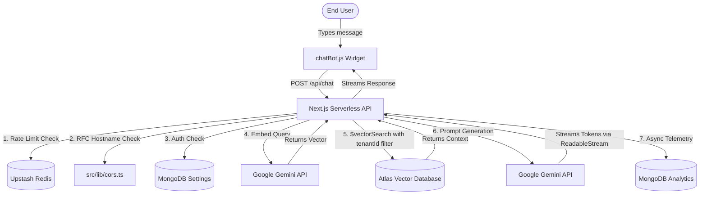

# NexSupport AI (Enterprise AI Customer Support)

[](https://nextjs.org/)
[](https://www.typescriptlang.org/)
[](https://www.mongodb.com/)
[](https://ai.google.dev/)
[](https://upstash.com/)
[](https://vitest.dev/)
[](https://github.com/)
[](https://opensource.org/licenses/MIT)

NexSupport AI is a modern, enterprise-ready B2B customer support platform that enables organizations to create, embed, and manage custom AI chatbots trained on their business documentation.

By uploading PDF manuals or text snippets, businesses generate an embeddable chat widget that provides their visitors with instant, 24/7 AI-driven support using Google's Gemini models and multi-tenant Retrieval-Augmented Generation (RAG).

---

## 🚀 Key Features

* **Multi-Tenant Architecture:** Securely isolates data, settings, and vector chunks across business tenants using `$vectorSearch` pre-filtering to guarantee tenant data separation.
* **Client-Side Batching Queue:** A custom React ingestion architecture designed to eliminate serverless execution timeouts on large multi-page PDFs by chunking on the client and streaming sequential 5-chunk batches to the embedding API.
* **Real-Time Token Streaming:** Delivers sub-300ms Time-to-First-Token (TTFT) by streaming responses from Gemini's `generateContentStream` through a standard Web `ReadableStream` directly into the embed widget.
* **Retrieval-Augmented Generation (RAG):** Context is split using **LangChain's RecursiveCharacterTextSplitter**, vectorized using `gemini-embedding-001` (768 dimensions), and queried with cosine similarity via MongoDB Atlas Vector Search.
* **Zero-Overhead Analytics Engine:** Tracks daily query volumes, deflection rates, and detects "Knowledge Gaps" (unanswered questions) using asynchronous TTL indexing without blocking user chat responses.
* **Embeddable Chat Widget:** A lightweight, dependency-free chat widget (`chatBot.js`) featuring modern Shadcn-style UI that embeds into any website with a single `<script>` tag.
* **Enterprise Authentication:** Seamless B2B login and session management powered by Scalekit (supporting SSO, SAML, and OAuth).

---

## 🔒 Security Posture

NexSupport AI implements strict, multi-layered enterprise security controls:

1. **RFC 3986 Hostname Firewall ([`src/lib/cors.ts`](./src/lib/cors.ts)):** The chat API verifies the exact `Origin` and `Referer` hostnames against tenant-allowed domains, strictly blocking substring bypasses, sibling suffix attacks (`evil-acme.com`), and referer query smuggling.
2. **Server-Side Session Validation (Anti-IDOR):** Client-supplied tenant IDs are ignored on mutating operations. All authenticated endpoints extract identity directly from verified session tokens via the `getSession()` utility.
3. **Multi-Layered Edge Rate Limiting:** Public chat (`/api/chat`) and ingestion (`/api/knowledge`) routes are shielded by Upstash Serverless Redis Sliding Window rate limiters to eliminate DDoS and brute-force attacks.
4. **Memory DoS & Payload Bounds:** Strict backend limits (10MB buffer maximum, 20 chunks per batch) reject oversized payloads before they reach Node.js memory buffers.
5. **XSS Sanitization:** The embed widget uses `textContent` DOM insertion instead of `innerHTML`, blocking stored and reflected Cross-Site Scripting.
6. **Error Sanitization (CWE-209 Patch):** Internal database drivers and stack traces are suppressed from client responses and logged exclusively on the server console.

---

## 🛠️ Tech Stack

### Frontend & Widget
- **Framework:** Next.js (App Router) & React
- **Styling & Motion:** TailwindCSS & Framer Motion (for real-time upload progress and micro-interactions)
- **Embed Widget:** Vanilla JS (`chatBot.js`) with streaming `ReadableStreamDefaultReader` and zero external dependencies

### Backend & Infrastructure
- **API Engine:** Next.js Serverless API Routes (with UTF-8 `ReadableStream` response streaming)
- **Database:** MongoDB & Mongoose (with connection pooling error-recovery in `db.ts`)
- **Vector Search:** MongoDB Atlas Vector Search (Cosine Similarity, 768 dimensions with pre-filtered `tenantId`)
- **Authentication:** Scalekit SDK (B2B Multi-Tenant OAuth)
- **Rate Limiting:** Upstash Serverless Redis (`@upstash/ratelimit`)

### AI & Testing
- **LLM Engine:** Google Gemini (`gemini-3.5-flash` with `generateContentStream` for generation, `gemini-embedding-001` for vectors)
- **NLP Processing:** LangChain (`RecursiveCharacterTextSplitter`) & `pdf-parse`
- **Testing & CI:** Vitest (Automated unit testing) & GitHub Actions (CI on push/PR with Node 22)

---

## 🧪 Automated Testing & CI/CD

The project includes an automated test suite powered by **Vitest** and enforced via **GitHub Actions** (`.github/workflows/ci.yml`):
* **AI NLP Mathematics:** Verifies LangChain's chunking configurations (overlap bounds, max chunk sizing) to ensure text isn't truncated or corrupted.
* **CORS Firewall Threat Vectors:** Asserts that `isOriginAllowed` handles valid domains, multi-level subdomains, port normalization (`localhost:3000`), and blocks adversarial suffix injections (`evil-acme.com.attacker.net`) and URL parameter smuggling.

To run the test suite locally:
```bash
npm test
```

To run lint checks:
```bash
npm run lint
```

---

## ⚙️ Local Development Setup

### 1. Clone the repository
```bash
git clone https://github.com/your-username/support-ai.git
cd support-ai
```

### 2. Install Dependencies
```bash
npm install
```

### 3. Configure Environment Variables
Create a `.env.local` file in the root directory:

```env
# MongoDB Connection
MONGODB_URL="mongodb+srv://<user>:<password>@cluster0.mongodb.net/support-ai?retryWrites=true&w=majority"

# Google Gemini API
GEMINI_API_KEY="your_google_gemini_api_key"

# Scalekit Authentication
SCALEKIT_ENVIRONMENT_URL="your_scalekit_env_url"
SCALEKIT_CLIENT_ID="your_scalekit_client_id"
SCALEKIT_CLIENT_SECRET="your_scalekit_client_secret"

# Upstash Redis (For Rate Limiting)
UPSTASH_REDIS_REST_URL="your_upstash_redis_url"
UPSTASH_REDIS_REST_TOKEN="your_upstash_redis_token"

# Public App URL
NEXT_PUBLIC_APP_URL="http://localhost:3000"
```

### 4. Database & Atlas Vector Index Setup
In your MongoDB Atlas cluster, navigate to **Atlas Search** > **Create Search Index** > **JSON Editor**, select the `knowledgechunks` collection, name the index `vector_index`, and use the following JSON definition:

> **Important:** The `tenantId` field **must** be defined with `type: "filter"` to enable tenant-isolated `$vectorSearch` queries.

```json
{
  "fields": [
    {
      "type": "vector",
      "path": "embedding",
      "numDimensions": 768,
      "similarity": "cosine"
    },
    {
      "type": "filter",
      "path": "tenantId"
    }
  ]
}
```

### 5. Start the Development Server
```bash
npm run dev
```
Navigate to `http://localhost:3000` to access the application.

---

## 🗺️ Project Structure

```text
├── .github/workflows/
│   └── ci.yml             # Automated CI pipeline (lint + unit tests on Node 22)
├── public/
│   └── chatBot.js         # Real-time streaming embeddable chat widget
├── src/
│   ├── app/
│   │   ├── api/           # Serverless API Routes (chat, knowledge, settings, analytics, auth)
│   │   ├── dashboard/     # Tenant Management UI (Settings, Knowledge, and Analytics)
│   │   └── embed/         # Embed script snippet generator & live preview
│   ├── components/        # React Components (DashboardClient, EmbedClient, HomeClient)
│   ├── lib/               # Utilities (db.ts connection pooling, cors.ts, Scalekit session)
│   ├── model/             # Mongoose Schemas (Settings, Knowledge, Analytics)
│   └── types.d.ts         # Centralized TypeScript interfaces
├── __tests__/             # Vitest Unit Test Suites
├── LICENSE                # MIT License
```

---

## 📡 Core API Routes

- `POST /api/chat`: Public-facing, CORS-protected endpoint that executes multi-tenant RAG and streams real-time AI responses via a Web `ReadableStream`.
- `POST /api/knowledge`: (Phase 1 Ingestion) Parses uploaded PDFs/TXT and runs LangChain to return structured text chunks to the browser.
- `POST /api/knowledge/embed`: (Phase 2 Ingestion) Receives chunk batches from the browser queue, calls Gemini Embeddings, and bulk-inserts vectors into MongoDB.
- `GET /api/knowledge`: Retrieves a tenant's uploaded documents and chunk processing stats.
- `DELETE /api/knowledge`: Removes a document and cascades deletion of all associated vector chunks.
- `GET /api/settings/public`: Exposes safe public widget branding tokens (color, icon, welcome text) to the embed script.
- `POST /api/settings`: Updates tenant configurations, including the CORS Domain Whitelist.
- `GET /api/analytics`: Fetches real-time chat volumes, deflection metrics, and unanswered knowledge gaps.

---

## 🏗️ Architecture Diagram



---

## 💡 How It Works

1. **Onboarding:** A business signs up via Scalekit and configures their chatbot's persona (Name, Support Email, and Allowed Domains).
2. **Ingestion (Batched):** The business uploads PDFs. The `/api/knowledge` endpoint parses the PDF and returns LangChain chunks. The React frontend orchestrates a Client-Side Queue, streaming batches of 5 chunks to `/api/knowledge/embed` while rendering a real-time progress bar to avoid serverless function execution timeouts.
3. **Integration:** The business copies the provided `<script src=".../chatBot.js" data-owner-id="..."></script>` and pastes it into their website's HTML.
4. **Chatting:** When a customer asks a question, the widget sends a CORS-secured POST request to `/api/chat`. 
5. **RAG Pipeline:** The backend rate-limits the request via Upstash, enforces RFC 3986 Hostname validation, embeds the user's question, performs a multi-tenant MongoDB Vector Search to find the most relevant document chunks, and streams real-time tokens using `gemini-3.5-flash` via a Web `ReadableStream`.
6. **Analytics:** The outcome of the conversation is asynchronously logged to MongoDB TTL Analytics collections without blocking the streamed response.

---

## 📄 License

This project is licensed under the MIT License - see the [LICENSE](./LICENSE) file for details.
