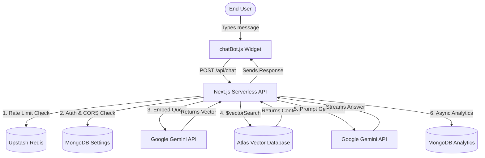

# NexSupport AI (Enterprise AI Customer Support)

NexSupport AI is a modern, enterprise-ready B2B platform that allows organizations to easily create, embed, and manage custom AI chatbots trained on their own data.

By simply uploading PDF documents or text snippets, businesses can generate an embeddable chat widget that provides their customers with instant, 24/7 AI-driven support using Google's Gemini models and Retrieval-Augmented Generation (RAG).

---

## 🚀 Key Features

* **Multi-Tenant Architecture:** Securely isolates data, settings, and documents between different business tenants using `$vectorSearch` pre-filtering to guarantee data privacy.
* **Retrieval-Augmented Generation (RAG):** Upload PDFs or text snippets to automatically train the chatbot. Text is intelligently chunked using **LangChain's RecursiveCharacterTextSplitter**, embedded using `gemini-embedding-001`, and searched via MongoDB Atlas Vector Search.
* **Zero-Overhead Analytics Engine:** Automatically tracks daily query volumes, deflection rates, and identifies "Knowledge Gaps" (questions the AI couldn't answer) using asynchronous TTL indexing—without adding latency to the chat responses.
* **Embeddable Chat Widget:** A lightweight, highly-customizable chat widget (`chatBot.js`) featuring modern Shadcn-style UI that businesses can embed into their websites with a single `<script>` tag.
* **Enterprise Authentication:** Seamless B2B login and session management powered by Scalekit (supporting SSO, SAML, etc.).

---

## 🔒 Security Posture

NexSupport AI implements strict, enterprise-grade security controls:

1. **Domain Whitelisting (CORS Firewall):** The chat API actively intercepts the `Origin` header and compares it against the tenant's authorized domains. Unauthorized websites attempting to hijack the embed script are instantly blocked with a `403 Forbidden`, preventing Gemini API quota exhaustion.
2. **Server-Side Session Validation:** Client-side IDs are ignored. All secure APIs extract the verified identity directly from the encrypted `access_token` cookie via the `getSession()` utility, preventing Insecure Direct Object Reference (IDOR) attacks.
3. **Edge Rate Limiting:** The publicly exposed `/api/chat` endpoint is shielded by an Upstash Serverless Redis Sliding Window rate limiter (15 requests/min per IP) to completely eliminate malicious bot traffic.

---

## 🛠️ Tech Stack

* **Frontend:** Next.js (App Router), React, TailwindCSS, Framer Motion
* **Backend:** Next.js Serverless API Routes
* **Testing:** Vitest
* **Authentication:** Scalekit SDK
* **Database & Vector Store:** MongoDB & MongoDB Atlas Vector Search (768 dimensions)
* **Rate Limiting:** Upstash Redis (`@upstash/ratelimit`)
* **AI & NLP:** Google Gemini API (`@google/genai`) and LangChain Text Splitters
* **File Processing:** `pdf-parse`

---

## 🧪 Automated Testing

The project includes a robust, lightning-fast unit testing suite powered by **Vitest** to mathematically prove core business logic:
* **AI NLP Algorithms:** Verifies LangChain's chunking configurations (overlap bounds, max chunk sizing) to ensure data isn't corrupted before embedding.
* **Security Rules:** Asserts that the Domain Whitelisting logic correctly handles authorized origins, malicious origins, and fallback modes.

To run the test suite locally:
```bash
npm run test
```

---

## ⚙️ Local Development Setup

### 1. Clone the repository
```bash
git clone https://github.com/your-username/support-ai.git
cd support-ai/support-ai
```

### 2. Install Dependencies
```bash
npm install
```

### 3. Environment Variables
Create a `.env.local` file in the root directory and configure the following required variables:

```env
# MongoDB Connection
MONGODB_URL="mongodb+srv://<user>:<password>@cluster0.mongodb.net/support-ai?retryWrites=true&w=majority"

# Google Gemini API
GEMINI_API_KEY="your_google_gemini_api_key"

# Scalekit Authentication
SCALEKIT_ENVIRONMENT_URL="your_scalekit_env_url"
SCALEKIT_CLIENT_ID="your_scalekit_client_id"
SCALEKIT_CLIENT_SECRET="your_scalekit_client_secret"

# Upstash Redis (For Rate Limiting)
UPSTASH_REDIS_REST_URL="your_upstash_redis_url"
UPSTASH_REDIS_REST_TOKEN="your_upstash_redis_token"
```

### 4. Database Setup
To enable the RAG pipeline, you must configure a **Vector Search Index** in your MongoDB Atlas cluster on the `knowledgechunks` collection.
- **Dimensions:** 768
- **Similarity:** cosine
- **Path:** embedding

### 5. Start the Development Server
```bash
npm run dev
```
Navigate to `http://localhost:3000` to view the application.

---

## 🗺️ Project Structure

```text
├── public/
│   └── chatBot.js         # The embeddable, cross-origin chat widget
├── src/
│   ├── app/
│   │   ├── api/           # Next.js Serverless API Routes
│   │   ├── dashboard/     # Tenant UI (Settings & Analytics)
│   │   └── embed/         # Preview of the embed widget
│   ├── components/        # React UI Components (DashboardClient)
│   ├── lib/               # Utilities (DB connection, Session)
│   └── model/             # Mongoose Schemas (Settings, Knowledge, Analytics)
├── __tests__/             # Vitest Unit Test Suites
```

---

## 📡 Core API Routes

- `POST /api/chat`: The public-facing, CORS-protected endpoint that handles incoming messages from the embedded widget, performs RAG, and streams AI responses.
- `POST /api/knowledge`: Ingests a new PDF, chunks it via LangChain, generates vector embeddings, and saves to MongoDB.
- `GET /api/knowledge`: Retrieves a tenant's uploaded PDFs and document chunk processing stats.
- `GET /api/analytics`: Fetches real-time chat volumes, deflection rates, and unanswered queries.
- `POST /api/settings`: Updates tenant configurations, including the CORS Domain Whitelisting array.

---

## 🏗️ Architecture Diagram



---

## 💡 How it works

1. **Onboarding:** A business signs up via Scalekit and configures their chatbot's persona (Name, Support Email, and Allowed Domains).
2. **Ingestion:** The business uploads knowledge (PDFs). The `/api/knowledge` endpoint parses the PDF, uses LangChain to generate intelligent overlapping chunks, and calls Gemini to generate vector embeddings. These are saved to MongoDB.
3. **Integration:** The business copies the provided `<script src=".../chatBot.js"></script>` and pastes it into their website's HTML.
4. **Chatting:** When a customer asks a question, the widget sends a CORS-secured POST request to `/api/chat`. 
5. **RAG Pipeline:** The backend rate-limits the request via Upstash, enforces Domain Whitelisting, embeds the user's question, performs a multi-tenant MongoDB Vector Search to find the most relevant document chunks, and returns a highly contextual answer via `gemini-3.5-flash`.
6. **Analytics:** The outcome of the conversation is asynchronously logged to the MongoDB TTL Analytics collections without blocking the user's response.
